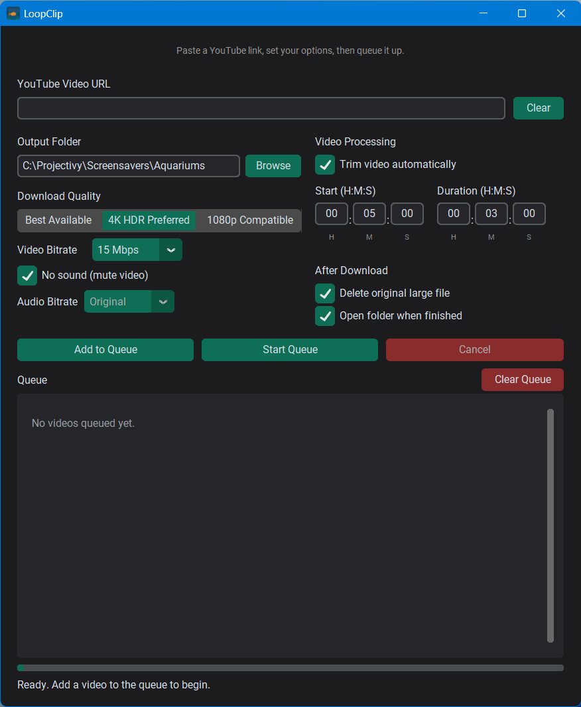

# LoopClip

*(Formerly Aquarium Downloader)*

A simple Windows app that downloads high-quality YouTube videos (aquariums,
aquascapes, fireplaces, rain, nature, or anything else) and automatically
finds a seamless loop point and re-encodes it into a ready-to-use looping
video screensaver - originally built for Projectivy Launcher on a 4K TV,
but works for any similar setup.

## Screenshot

[](screenshot.png)

## What's implemented

- Paste-a-URL, click-Add-to-Queue workflow with clipboard auto-detect
- **Queue-based** - add several videos, then start the queue and let them
  process one after another unattended
- Quality modes: Best Available / 4K HDR Preferred / 1080p Compatible
- **Automatic seamless-loop detection** - instead of typing a trim start/
  duration, LoopClip analyzes the video's frames (SSIM, color histogram,
  and/or perceptual hashing) and finds the point where it can loop
  invisibly on its own. Choose a comparison **Method** (Combined / SSIM /
  Histogram / Hash), a **Similarity** threshold, and optionally limit
  analysis to a specific window of a long video (with an **Analyze every
  Nth frame** setting to speed up long searches)
- Stream-copy trimming (no re-encode / no quality loss) with automatic
  re-encode fallback if a codec can't be cut cleanly at the detected loop
  point
- Re-encode fallback targets **H.265/HEVC**, forced **4K UHD (3840x2160)**
  output, **30fps**, and a **user-selectable target bitrate** (8 / 15 / 25 /
  40 Mbps)
- **Seamless loop crossfade** (optional) - blends the last couple of
  seconds of the detected loop into its first couple of seconds, so the
  loop point fades instead of jump-cutting when Projectivy repeats it.
  Adjustable crossfade length (1 / 2 / 3 sec)
- **GPU-accelerated** re-encoding via NVIDIA NVENC when available, with an
  automatic CPU (libx265) fallback if no compatible Nvidia GPU is present.
  (Note: this is the *encoding* GPU path. Loop-detection frame analysis
  itself runs on CPU - see [Loop detection performance](#loop-detection-performance) below)
- Adjustable output audio bitrate, or mute entirely
- A standalone **command-line interface** (`cli.py`) for scripting/
  automation, with LoopyCut-style flags (`--similarity`, `--method`,
  `--start`/`--stop`, `--downsample`, etc.) - see [Command-line usage](#command-line-usage)
- "Clear URL" and "Clear Queue" buttons for quickly resetting either
- Settings remembered between runs (folder, quality, loop-detection
  settings, bitrates, checkboxes) - and automatically migrated forward if
  you're upgrading from the old Aquarium Downloader name or an older
  manual-trim version of LoopClip
- Per-item progress in the queue list: percent / speed / ETA while
  downloading, and frame-extraction/comparison progress while analyzing,
  updated smoothly without flickering even with several items queued at
  once
- Friendly error messages for missing tools, bad URLs, network failures,
  low disk space, and "no loop found at this similarity" cases
- Dark, Windows-11-style UI (CustomTkinter)

**Not included** (can be added later): drag-and-drop, video library
manager, playlist/channel downloads, GPU-accelerated frame analysis.

## How to use it

1. **Paste a YouTube URL** into the box at the top - or just copy one
   from your browser, LoopClip will detect it and fill the box in
   automatically.
2. **Set your options** - Output Folder, Download Quality, Video/Audio
   Bitrate.
3. Under **Video Processing**, leave **Auto-detect seamless loop** checked
   (recommended) and choose a **Method** and **Similarity** threshold - or
   uncheck it to skip loop detection and just download/re-encode the
   video as-is. Optionally check **Limit search window** to only analyze
   part of a long video (faster) instead of the whole thing. Turn on
   **Seamless loop crossfade** if you want the detected loop point to
   fade rather than jump-cut.
4. Click **Add to Queue**. Repeat for as many videos as you like - each
   one remembers whatever options were set at the moment you added it.
5. Click **Start Queue**. Videos download, get analyzed for a loop point,
   and get trimmed/encoded one at a time; watch progress in the list
   below. **Cancel** stops the current item immediately and halts the
   rest of the queue.
6. Finished files land in your chosen Output Folder, ready to point
   Projectivy (or any other screensaver/wallpaper tool) at.

**No loop found?** Lower the Similarity threshold, try a different
Method, or widen the search window - same troubleshooting idea as most
loop-detection tools: a stricter threshold or a narrower search window
means fewer/no frame pairs will qualify.

## Requirements

- Windows 11
- Python 3.10+
- **FFmpeg** installed and on your system PATH (the app checks for this
  and will tell you clearly if it's missing) - download from
  <https://ffmpeg.org/download.html>
- **opencv-python** and **numpy** (for loop detection frame analysis) -
  installed via `requirements.txt`; the app checks for these too
- **scikit-image** (optional, but recommended) - enables the SSIM and
  Combined comparison methods; if it's missing, those methods
  automatically fall back to the Hash method instead of failing
- An NVIDIA GPU is recommended for fast re-encoding (NVENC), but not
  required - the app automatically falls back to CPU encoding if one
  isn't available. CPU encoding at forced 4K resolution can be
  significantly slower, especially with the seamless loop feature
  enabled (it always re-encodes, since crossfading can't be done as a
  stream copy)

## Setup (development / running from source)

If you're using a Python install that already has PyInstaller and other
packages available globally (no virtual environment), you can skip
straight to `pip install -r requirements.txt` and `python main.py`.
Using a virtual environment is optional but recommended if you want to
keep this project's dependencies separate from other Python projects:

```
cd LoopClip
python -m venv venv
venv\Scripts\activate
pip install -r requirements.txt
python main.py
```

### Running without building an exe

Once dependencies are installed, any of these will start the app:

- Double-click **LoopClip.vbs** (silent launch, no console window)
- Double-click **Run LoopClip.bat** (also silent)
- From a terminal: `python main.py` (or `pythonw main.py` for no console
  window)

## Command-line usage

For scripting or automation without the GUI, `cli.py` exposes the same
download + auto-loop-detect + encode pipeline with LoopyCut-style flags:

```bash
# Automatic loop detection on a local file
python cli.py input.mp4 output.mp4

# From a YouTube URL, custom similarity/method
python cli.py https://youtu.be/XXXXXXXXXXX output.mp4 --similarity 95 --method ssim

# Only analyze a specific window of a long video (faster on long sources)
python cli.py input.mp4 output.mp4 --start 00:00:30 --stop 00:05:00 --downsample 4

# Skip auto-detection entirely - just download/re-encode as-is
python cli.py https://youtu.be/XXXXXXXXXXX output.mp4 --no-auto-loop

# Add a 2-second crossfade at the loop point
python cli.py input.mp4 output.mp4 --crossfade 2
```

| Option | Description | Default |
|--------|-------------|---------|
| `--start` | Start of the search window (HH:MM:SS) | `00:00:00` |
| `--stop` | End of the search window (HH:MM:SS) | end of video |
| `--similarity` | Match threshold, 0-100 | `98` |
| `--method` | `combined` / `ssim` / `histogram` / `hash` | `combined` |
| `--downsample` | Analyze every Nth frame | `1` |
| `--min-length` / `--max-length` | Loop length bounds, in seconds | auto |
| `--no-auto-loop` | Skip loop detection - download/re-encode as-is | off |
| `--crossfade` | Seconds of crossfade at the loop point | off (hard cut) |
| `--quality` | `best` / `4k_hdr` / `1080p` | `best` |
| `--video-bitrate` | Target video bitrate, Mbps | `15` |
| `--audio-bitrate` | `original` or kbps | `original` |
| `--no-audio` | Strip audio from the output | off |
| `--verbose` | Print frame-extraction/comparison progress | off |

## Building a standalone LoopClip.exe

Once everything runs correctly from source:

```
python -m PyInstaller --noconfirm --onefile --windowed --icon icon.ico --name LoopClip main.py
```

(`python -m PyInstaller` avoids relying on a separate `pyinstaller.exe` being
on your PATH - useful if the bare `pyinstaller` command isn't recognized.
If `python` itself isn't recognized either, try `py -m PyInstaller ...`
instead.)

> **Note:** `opencv-python` and `scikit-image` can need explicit
> `--hidden-import`/`--collect-all` flags (or entries in `LoopClip.spec`)
> to bundle cleanly with PyInstaller, since both ship compiled extensions
> PyInstaller doesn't always auto-detect. If the built .exe fails to start
> or errors out specifically when analyzing a video, check `LoopClip.spec`
> first before assuming FFmpeg or yt-dlp is the problem.

The finished executable will be at `LoopClip.exe` (PyInstaller also
leaves a copy in `dist\LoopClip.exe` - either works, they're identical;
most people just use the one in the project root and can delete the
`dist`/`build` folders afterward). Users can run this directly - they do
not need Python installed. FFmpeg still needs to be installed separately
and on PATH (this is standard for yt-dlp-based tools and keeps the .exe
small; the app will show a clear message if it's missing).

## Project structure

```
LoopClip/
├── main.py              # GUI + orchestration (CustomTkinter)
├── cli.py                # Command-line interface (no GUI)
├── downloader.py         # yt-dlp wrapper: URL validation, format selection, progress
├── loop_detector.py       # Automatic seamless-loop detection (frame extraction + SSIM/histogram/hash)
├── processor.py          # FFmpeg wrapper: trimming, re-encoding, seamless loop crossfade
├── queue_manager.py      # Owns the download queue and its background worker thread
├── settings.py           # Persisted settings (JSON in %APPDATA%\LoopClip)
├── tool_check.py         # Detects yt-dlp / FFmpeg / opencv-numpy availability
├── LoopClip.vbs          # Silent launcher (no console window)
├── Run LoopClip.bat      # Alternative silent launcher
└── requirements.txt
```

## Notes on quality handling

- "Best Available" lets yt-dlp pick the actual best video+audio streams
  regardless of codec (AV1/VP9/H.264).
- Only the window that will actually be analyzed is downloaded (with a
  small padding buffer), rather than the whole source video, when a
  search window is set - keeps long-video analysis fast.
- Loop-detection frame analysis runs on CPU: frames are downscaled to a
  manageable size, then compared using the chosen method (a cheap
  perceptual-hash pass pre-filters candidates before the more expensive
  SSIM/histogram scoring runs on survivors).
- Trimming to the detected loop point uses `ffmpeg -c copy` (stream copy)
  first so no quality is lost and processing is nearly instant; it only
  falls back to a re-encode if the source codec doesn't allow a clean
  copy-cut at that timestamp.
- When a re-encode is needed, it targets H.265/HEVC at your chosen
  bitrate, always at full 4K UHD resolution regardless of the source
  resolution, and tries NVIDIA NVENC (GPU) first for speed before falling
  back to a CPU encode.
- The seamless loop crossfade step, if enabled, always re-encodes (it's
  not possible as a stream copy), using the same H.265/NVENC-first/4K
  approach as above, and runs as a final pass after trimming.

## Loop detection performance

Comparing every valid frame pair is naturally slower on long videos or at
full frame rate. A few ways to speed it up:

- **Limit the search window** (`Limit search window` in the GUI, or
  `--start`/`--stop` on the CLI) to the portion of the video you actually
  expect a loop in, rather than analyzing the whole thing.
- **Increase the downsample rate** (`Analyze every Nth frame`, or
  `--downsample` on the CLI) - analyzing every 2nd/4th/8th frame instead
  of every frame cuts comparison time roughly proportionally, at some
  cost to precision.
- **Use the Hash method** for the fastest (if least precise) comparison,
  or **Combined**/**SSIM** for the most accurate.

Frame analysis is CPU-only in this version (LoopClip targets Windows/
NVIDIA, and re-encoding already uses NVENC where available - a
CUDA-accelerated analysis backend is a possible future addition for very
long videos).

## A note on the rename

This project started life as **Aquarium Downloader**, aimed narrowly at
aquarium screensaver footage. Since it works equally well for any looping
background video, it's now **LoopClip**. If you're upgrading from an
older Aquarium Downloader install, your existing settings are carried
over automatically on first run - nothing to do manually.

## 📜 License

This project is released under the [MIT License](License.txt).

You are free to use, modify, and share this software.